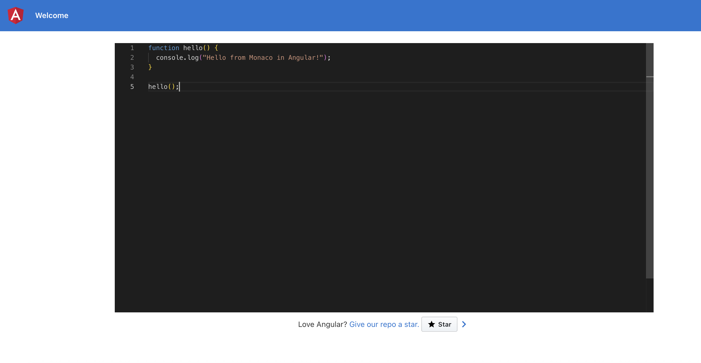

# Angular Monaco Editor – POC

Este repositório demonstra como integrar o `monaco-editor` em uma aplicação Angular usando `@angular-builders/custom-webpack` e `monaco-editor-webpack-plugin`.



## Pré-requisitos
- `Node.js` LTS e `npm` instalados
- `Angular CLI` (`npm i -g @angular/cli`)

## Instalação e execução
- Instale as dependências: `npm install`
- Suba o servidor de desenvolvimento: `npm start`
- Acesse em `http://localhost:4200/`

## Como o Monaco Editor está integrado
- Dependências principais:
  - `monaco-editor` (runtime)
  - `monaco-editor-webpack-plugin` (build-time)
  - `@angular-builders/custom-webpack` para permitir `webpack.config.js`
- Configuração do builder no `angular.json`:
  - `builder`: `@angular-builders/custom-webpack:browser`
  - `customWebpackConfig.path`: `webpack.config.js`
- Plugin do Monaco configurado em `webpack.config.js` selecionando linguagens:

```js
// webpack.config.js
const MonacoWebpackPlugin = require('monaco-editor-webpack-plugin');

module.exports = {
  module: {
    rules: [
      { test: /\.css$/, use: ['style-loader', 'css-loader'] },
      {
        test: /\.(ttf|woff|woff2|eot|svg)$/,
        type: 'asset/resource',
        generator: { filename: 'assets/fonts/[name][hash][ext]' }
      }
    ]
  },
  plugins: [
    new MonacoWebpackPlugin({
      languages: ['typescript', 'javascript', 'json', 'css', 'html']
    })
  ]
};
```

## Exemplo de uso no componente
O editor é criado programaticamente no `MonacoEditorComponent`:

```ts
// src/app/monaco-editor/monaco-editor.component.ts
import { AfterViewInit, Component, ElementRef, OnDestroy, ViewChild } from '@angular/core';
import * as monaco from 'monaco-editor';

@Component({
  selector: 'app-monaco-editor',
  standalone: true,
  templateUrl: './monaco-editor.component.html',
  styleUrls: ['./monaco-editor.component.scss']
})
export class MonacoEditorComponent implements AfterViewInit, OnDestroy {
  @ViewChild('editorContainer', { static: true }) editorContainer!: ElementRef<HTMLDivElement>;
  private editor?: monaco.editor.IStandaloneCodeEditor;

  ngAfterViewInit(): void {
    this.editor = monaco.editor.create(this.editorContainer.nativeElement, {
      value: [
        'function hello() {',
        '  console.log("Hello from Monaco in Angular!");',
        '}',
        '',
        'hello();'
      ].join('\n'),
      language: 'typescript',
      theme: 'vs-dark',
      automaticLayout: true,
      minimap: { enabled: false }
    });
  }

  ngOnDestroy(): void {
    this.editor?.dispose();
    monaco.editor.getModels().forEach((m) => m.dispose());
  }
}
```

HTML do componente:

```html
<!-- src/app/monaco-editor/monaco-editor.component.html -->
<div #editorContainer class="editor-root"></div>
```

Estilo para ocupar a área disponível:

```scss
// src/app/monaco-editor/monaco-editor.component.scss
.editor-root {
  height: 100vh;
  width: 100%;
}
```

## Personalização rápida
- `language`: por exemplo `typescript`, `javascript`, `json`, `css`, `html` (conforme ativadas no plugin)
- `theme`: `vs`, `vs-dark`, `hc-black`
- `automaticLayout`: ajusta o layout ao redimensionar
- `minimap.enabled`: mostra/esconde o minimapa

Para adicionar novas linguagens, edite `webpack.config.js` em `MonacoWebpackPlugin({ languages: [...] })`.

## Build de produção
- Execute `npm run build`
- Saída em `dist/editor-poc`

## Dicas
- Se o editor não renderizar, confirme se o container tem altura (`height`) definida.
- Evite criar/destroi múltiplas instâncias sem `dispose()` para não vazar memória.

## Recursos
- Monaco Editor: https://microsoft.github.io/monaco-editor/
- Angular Custom Webpack Builder: https://github.com/just-jeb/angular-builders/tree/master/packages/custom-webpack
